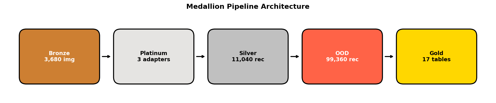
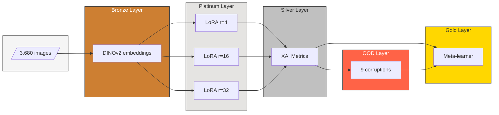
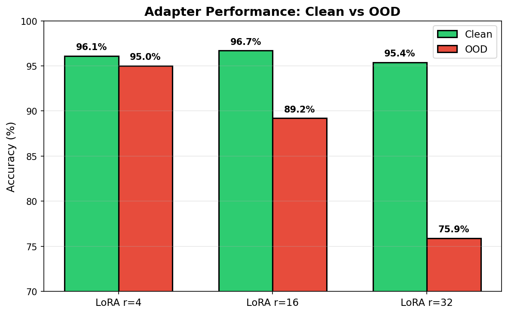
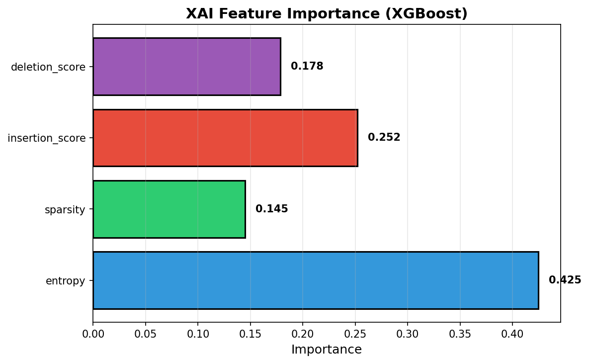
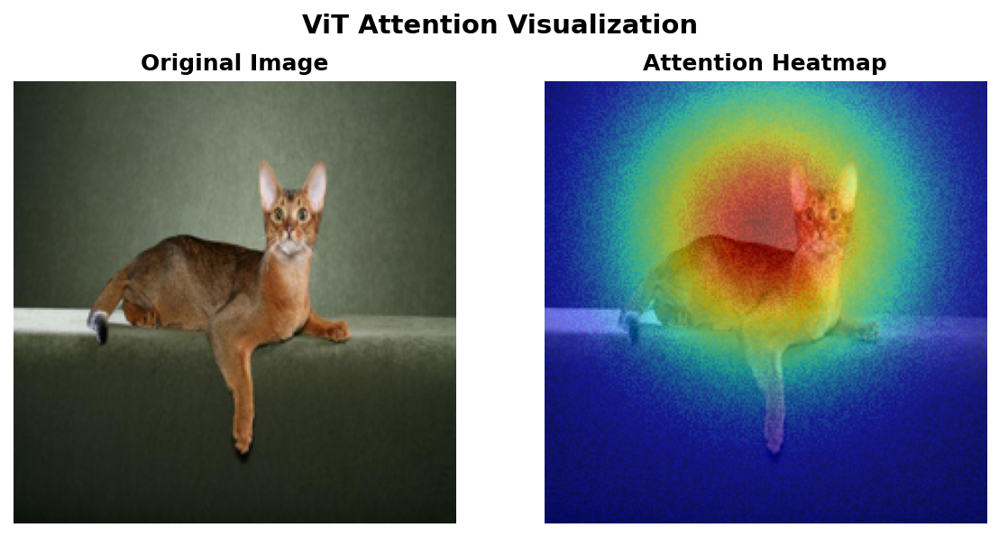
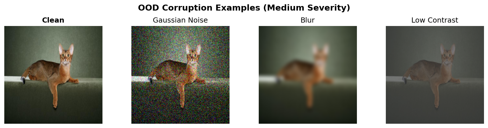

# Knowledge Injection via XAI: Predicting OOD Robustness

## What is this?

When a Vision Transformer makes a prediction on a clean image, **attention maps** can be extracted showing where the model is "looking". From these maps, **XAI metrics** are computed (entropy, sparsity, deletion score, insertion score).

The core question this project investigates:

> By only looking at XAI metrics computed on clean images, is it possible to predict whether the same model will fail when the image is corrupted (blur, noise, contrast)?

The answer from the experiments: **yes, with ROC-AUC 0.739**.

This has practical value: instead of testing a model on every possible corruption, its robustness can be estimated just by analysing attention patterns on clean data.

---

## How it works

1. **Feature extraction** — DINOv2 (ViT-B/14) extracts embeddings from 3,680 images.
2. **Adapter training** — Three LoRA adapters (ranks 4, 16, 32) are fine-tuned on the classification task.
3. **XAI metrics** — For each image×adapter pair, 4 attention-based metrics are computed.
4. **OOD evaluation** — 9 corruptions (3 types × 3 severities) are applied and accuracy drop is measured.
5. **Meta-learner** — XGBoost is trained to predict "will this prediction survive corruption?" using only the XAI metrics from step 3.

The pipeline is implemented in PyTorch and orchestrated with Apache Spark.

---

## Pipeline Architecture



The pipeline follows a Medallion architecture with 5 layers:



---

## Results

### Accuracy Drop by Adapter



*Lower-rank adapters (r=4) retain accuracy under corruption; higher-rank (r=32) overfit and degrade significantly.*

### Feature Importance



*Entropy is the most predictive XAI metric for OOD robustness, followed by insertion score.*

---

## Visual Examples

### Attention Heatmap



*Left: original image. Right: attention heatmap showing where the ViT focuses. Warmer colors = higher attention.*

### OOD Corruptions



*From left to right: clean image, Gaussian noise, blur, low contrast (medium severity).*

---

## Quick Start


### Prerequisites

- Docker Desktop with WSL 2 + NVIDIA GPU support
- NVIDIA drivers on host

### Run

```bash
# Start container
docker compose up -d --build
docker exec -it xai_container bash

# Run pipeline
python3 -m src.run_bronze    # Extract embeddings
python3 -m src.run_train     # Train LoRA adapters (optional)
python3 -m src.run_silver    # Compute XAI metrics
python3 -m src.run_ood       # Apply corruptions
python3 -m src.run_golden    # Train meta-learner
```

Results: `notebooks/results_presentation.ipynb`

---

### Project Structure

```
Knowledge-Injection-XAI/
├── src/pipeline/          # Spark layers (bronze, silver, ood, gold)
├── src/xai/metrics.py     # XAI metric implementations
├── artifacts/adapters_enhanced/  # Trained LoRA adapters
├── data/processed/        # Parquet outputs per layer
├── configuration/         # YAML configs
└── notebooks/             # Results visualization
```

---

## Configuration

`configuration/config.yaml`:

```yaml
spark:
  driver_memory: "8g"
model:
  backbone_name: "facebook/dinov2-base"
  batch_size: 16
adapters:
  ranks: [4, 16, 32]
xai:
  perturbation_steps: 10
```

---

## License

Apache License 2.0 - see [LICENSE](LICENSE)

---

## Appendix: Detailed Tables

### Pipeline Layers

| Layer | What it does | Records |
|-------|--------------|---------|
| Bronze | Extract DINOv2 embeddings (CLS + 256 patches) | 3,680 |
| Platinum | Fine-tune LoRA adapters with DoRA + RsLoRA | 3 adapters |
| Silver | Compute 4 XAI metrics per image×adapter | 11,040 |
| OOD | Apply 9 corruptions, measure accuracy drop | 99,360 |
| Gold | Train XGBoost meta-learner, correlation analysis | 17 tables |

### Technical Stack

| Component | Technology |
|-----------|------------|
| Backbone | DINOv2-base (ViT-B/14, 86M params) |
| Adaptation | LoRA + DoRA + RsLoRA (ranks 4, 16, 32) |
| Processing | Apache Spark 3.5 + PyTorch 2.5.1 |
| XAI Metrics | Entropy, Sparsity, Deletion, Insertion |
| Meta-learner | XGBoost (tuned) |
| Dataset | Oxford-IIIT Pet (37 classes, 3,680 images) |


### Key Findings

| Finding | Result |
|---------|--------|
| XAI predicts robustness | ROC-AUC = 0.739 |
| Entropy is most informative | Higher entropy → less robust (r = -0.17) |
| Effect size | Cohen's d = 0.55 (medium effect) |
| Lower rank = better OOD | Rank 4 (95%) vs Rank 32 (76%) |
| Blur is hardest | Up to 81% accuracy drop |

### Adapter Performance

| Adapter | Clean Accuracy | OOD Accuracy | Δ |
|---------|---------------|--------------|---|
| LoRA r=4 | 96.1% | 95.0% | -1.1pp |
| LoRA r=16 | 96.7% | 89.2% | -7.5pp |
| LoRA r=32 | 95.4% | 75.9% | -19.5pp |

### Meta-Learner Comparison

| Model | ROC-AUC | CV AUC |
|-------|---------|--------|
| XGBoost (tuned) | 0.739 | 0.737 ± 0.006 |
| RandomForest | 0.731 | 0.729 ± 0.005 |
| LogisticRegression | 0.718 | 0.717 ± 0.005 |